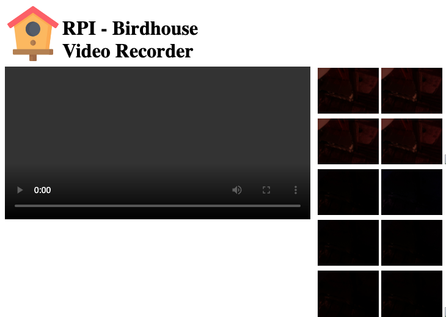

# rpi-birdhouse-video-recorder
A birdhouse that records the birds lifehood using RaspberryPI



## Install 

### Prepare the PI
```bash
apt update
apt install ffmpeg
apt install raspistill
apt install raspivid
```

### Install Code Dependencies
```bash
npm install
```

### Execute inside the RaspberryPI
Start the node web application
```bash
npm start
```

In your computer open the browser pointing to the raspberry pi and use port 8080

For example: http://mybirdhouse:8080/


### To run on boot
```bash
sudo npm install pm2 -g
pm2 startup systemd
```
Follow the instruction to install the script
```
pm2 start --name=BIRDHOUSE npm -- start
pm2 save
```


## References
- http://frozen.ca/streaming-raw-h-264-from-a-raspberry-pi/
```
raspivid -n -ih -t 0 -rot 0 -w 1280 -h 720 -fps 15 -b 1000000 -o - | nc -lkv4 5001
```

- https://fullstack.network/streaming-video-from-raspberrypi-to-the-network-using-node-js-33a5b6b78c3d

- https://linuxize.com/post/how-to-install-node-js-on-raspberry-pi/